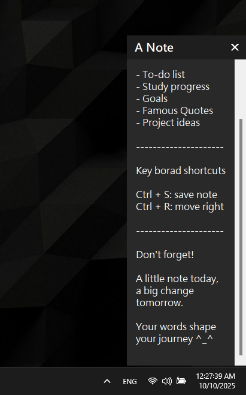
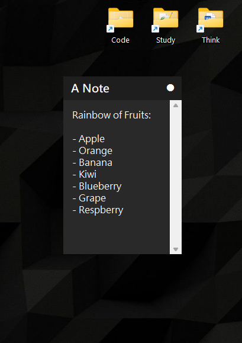

# A-simple-desktop-note-tool
A lightweight Python desktop note-taking program.  
This program is my first open source project!  

  
  &nbsp;&nbsp;&nbsp;&nbsp;&nbsp;&nbsp;&nbsp;&nbsp;
  

## Why I built this
- It's convenient to jot down to-do lists directly on the desktop
- It serves as a digital alternative to sticky notes, saving both space and paper.  
- It helps capture sudden ideas before they slip away.

 

## Keyboard shortcut
Ctrl + S: save your note  
Ctrl + R: move right bottom corner of the screen  

 

## Don't forget
A little note today, a big change tomorrow.  
Your words shape your journey ^_^  
